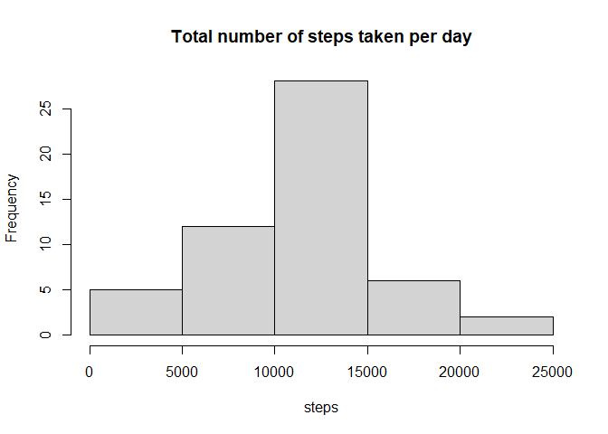

Course Assignment - Reproducible Research
================

## Introduction

This assignment makes use of data from a personal activity monitoring
device. This device collects data at 5 minute intervals through out the
day. The data consists of two months of data from an anonymous
individual collected during the months of October and November, 2012 and
include the number of steps taken in 5 minute intervals each day.

## Data set

The data for this assignment can be downloaded from the course website.

-   Dataset : [Activity monitoring
    data](https://d396qusza40orc.cloudfront.net/repdata%2Fdata%2Factivity.zip "Activity monitoring data")

The variables included in this dataset are:

-   **steps**:Number of steps taking in a 5-minute interval(missing
    values)

-   **date**:The date on which the measurement was taken in YYYY-MM–DD
    format

-   **interval**:Identifier for the 5-minute interval in which
    measurement was taken

The dataset is stored in a comma-separated-value(CSV) file and there are
a total of 17,568 observations in this dataset.

## Loading & Preprocessing the dataset

First step that I have to do is to store and load the data. If there is
no directory that only stores the data then I’m going to create a
directory call “data”.

``` r
if(!file.exists("data")){
  dir.create("data")
}

fileUrl <- "https://d396qusza40orc.cloudfront.net/repdata%2Fdata%2Factivity.zip"
download.file(fileUrl, destfile = "./data/monitoring.zip")
unzip("./data/monitoring.zip",exdir="./data")
```

After I finish downloading and unzipping the data, I’ll load the data
naming act1.

``` r
act1 <- read.csv("./data/activity.csv")
act1$date <- as.Date(act1$date,"%Y-%m-%d")
```

Making a dataset that has no missing values just in case.

``` r
na_act <- act1[complete.cases(act1),]
```

-   **Question 1**. **What is the mean total number of steps taken per
    day.**

1.  Calculate the total number of steps taken per day

2.  Make a histogram of the total number of steps taken each day

3.  Calculate and report the mean and median of the total number of
    steps taken per day

First I have to make a data set that fits this question.

``` r
total_dbd <- aggregate(steps~date,na_act,sum) 
```

Now, we made a dataset that has the total steps taken by the day. Lets
make a histogram.

``` r
with(total_dbd,hist(steps,
                       xlab="steps",ylab="Frequency",
                       main = "Total number of steps taken per day"))
```

<!-- -->

At last, we have to find the mean and median of the total number of
steps taken per day.

``` r
print(paste("Mean of total number of steps taken per day is ",mean(total_dbd$steps)))
```

    ## [1] "Mean of total number of steps taken per day is  10766.1886792453"

``` r
print(paste("Median of total number of steps taken per day is ",median(total_dbd$steps)))
```

    ## [1] "Median of total number of steps taken per day is  10765"

-   **Question 2**. **What is the average daily activity pattern?**

1.  Make a time series plot(i.e type = “l”)of the 5-minute
    interval(x-axis) and the average number of steps taken, averaged
    across all days(y-axis)

2.  Which 5-minute interval, on average across all the days in the
    dataset, contains the maximum number of steps?

To accomplish this question, I have to make another dataset. I have to
average the steps by each interval.

``` r
avg_step1 <- aggregate(steps~interval,na_act,mean)
head(avg_step1)
```

    ##   interval     steps
    ## 1        0 1.7169811
    ## 2        5 0.3396226
    ## 3       10 0.1320755
    ## 4       15 0.1509434
    ## 5       20 0.0754717
    ## 6       25 2.0943396

Since I got the dataset, let’s make a time series plot

``` r
with(avg_step1,plot(interval,steps,type="l",
                   xlab="5minute of interval",ylab="the average numbers of steps taken all day"))
```

<!-- -->

To see which interval is the greatest, we can easily find it by using
which.max function

``` r
avg_step1[which.max(avg_step1$steps),1]
```

    ## [1] 835

The result interval level contains the maximum number of steps.

-   **Question 3**. **Imputing missing values**

Note that there are a number of days/intervals where there are missing
values(coded as NA). The presence of missing days may introduce bias
into some calculations or summaries of the data.

1.  Calculate and report the total number of missing values in the
    dataset(i.e. the total number of rows with NAS)

2.  Devise a strategy for filling in all of the missing values in the
    dataset. The strategy does not need to be sophisticated. For
    example, you could use the mean/median for that day, or the mean for
    the 5-minute interval, etc.

3.  Create a new dataset that is equal to the original dataset but with
    the missing data filled in.

4.  Make a histogram of the total number of steps taken each day and
    Calculate the report the **mean** and **median** total number of
    steps taken per day. Do these values differ from the estimates from
    the first part of the assignment? What is the impact of imputing
    missing data on the estimates of the total daily number of steps?

I’ve eliminated all the missing values to answer the previous question.
In this question, I have to reset the dataset and fill in the missing
values instead of erasing them.

First I’m going to find out how many missing values are in the raw data.

``` r
table(is.na(act1$steps))
```

    ## 
    ## FALSE  TRUE 
    ## 15264  2304

As we see from the table, we can find out that there are 2304 missing
values in the dataset. Instead of removing all the missing values, I’ll
fill this out using the mean for the 5-minute interval. The total number
of steps taken per day will increase but the mean and median will be the
same.

Using for loop can make it easy to fill in the missing values. I’m also
going to use avg\_step1 that we previously made to fill the missing
values.

``` r
for(i in 1:nrow(act1)){
  if(is.na(act1[i,1])){
    interval_num <- act1[i,3]
    act1[i,1] <- avg_step1[avg_step1$interval== interval_num,2]
  }
}

head(act1)
```

    ##       steps       date interval
    ## 1 1.7169811 2012-10-01        0
    ## 2 0.3396226 2012-10-01        5
    ## 3 0.1320755 2012-10-01       10
    ## 4 0.1509434 2012-10-01       15
    ## 5 0.0754717 2012-10-01       20
    ## 6 2.0943396 2012-10-01       25

Now, let’s see the **mean** and **median** of the total number of steps
taken per day.

``` r
mean(act1$steps)
```

    ## [1] 37.3826

``` r
median(act1$steps)
```

    ## [1] 0

Compare with the dataset that has no missing values. We are going to use
the dataset that we previously made.

``` r
mean(na_act$steps)
```

    ## [1] 37.3826

``` r
median(na_act$steps)
```

    ## [1] 0

We can find out that there are no differences between the two datasets.

The Question wanted me to show the total number of steps taken per day.
So I have to make another dataset called act\_day to plot easier.

Let’s see the result.

``` r
act_day <- aggregate(steps~date,act1,sum)

with(act_day,hist(steps,xlab="dates",
               ylab="total steps",
               main = "Total number of steps taken per day"))
```

<!-- -->

-   **Question 4**. **Are there differences in activity patterns between
    weekdays and weekends?**

For this part, use the dataset with the filled-in missing values for
this part.

1.  Create a new factor variable in the dataset with two levels -
    “weekday” and “weekend” indicating whether a given date is a weekday
    or weekend day.

2.  Make a panel plot containing a time series plot(i.e **type = “l”**)
    of the 5-minute interval(x-axis) and the average number of steps
    taken, averaged across all weekday days or weekend days(y-axis). See
    the README file in the Github repository to see an example of what
    this plot should look like using simulated data.

Instead of using a new factor variable, I used a data frame to store the
weekend and weekday data. If I use factor variable to handle this
question, using ggplot will make the better graphic. But I did not
choose to do it that way.

First, I made a data set that contains the observation whether it’s
weekdays.

``` r
weekdays2 <- weekdays(act1[,2])


act4 <- cbind(act1,weekdays = weekdays2)
```

Then I made two empty data frames to store the weekday data and weekend
data. I used for loop to separate the observations. I saved the Weekday
observations in the wd\_act data frame and weekend observations in the
weeknd\_act data frame.

``` r
wd_act <- data.frame()
weeknd_act <- data.frame()

for(i in 1:nrow(act4)){
  if(act4[i,4]== "토요일" | act4[i,4] == "일요일"){
    weeknd_act <- rbind(weeknd_act,act4[i,])
  }
  else {
    wd_act <- rbind(wd_act,act4[i,])
  }
}
```

To compare the weekend data and weekday data, I used the par function to
see both plots on one screen.

``` r
wd_act1 <- aggregate(steps~interval,wd_act,mean)

weeknd_act1 <- aggregate(steps~interval,weeknd_act,mean)

par(mfrow = c(2,1))

with(wd_act1,plot(steps~interval,type="l", xlab="Interval", ylab="Average steps", ylim=c(0,250), main = "Comparison between Weekdays and Weekend"))

with(weeknd_act1,plot(steps~interval,type="l", xlab="Interval", ylab="Average steps", ylim=c(0,250)))
```

<!-- -->

The top is the weekday plot and the bottom is the weekend plot.
